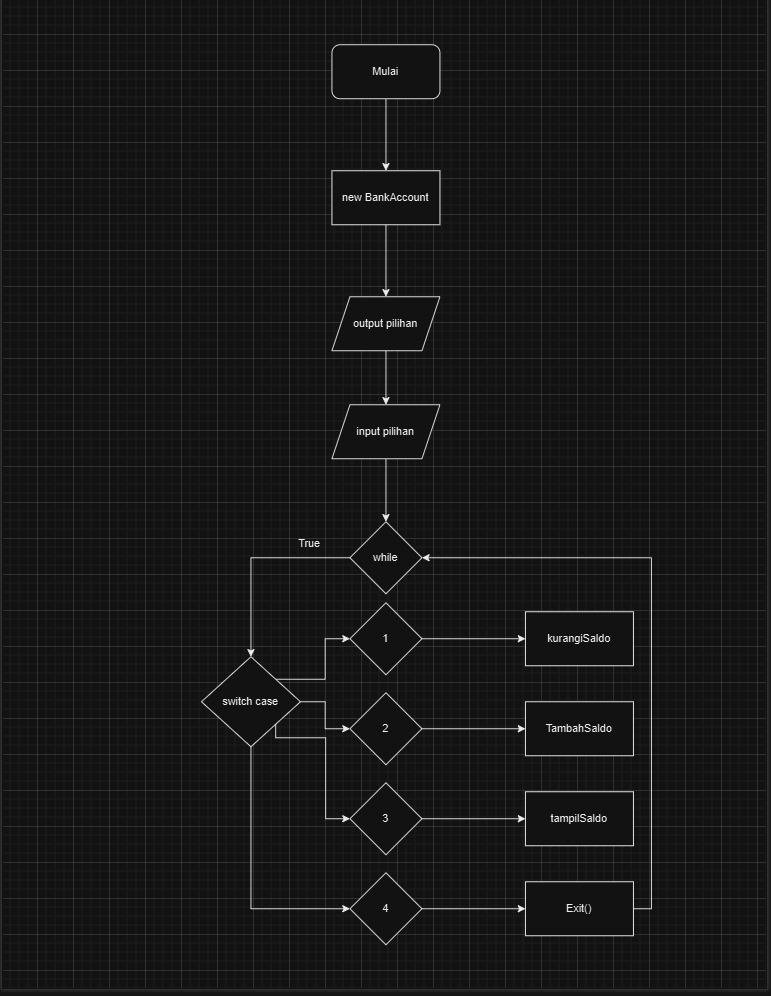

new Endpoint
1. GET / = for welcome page
2. GET /notification = for notification forgot and reset password
3. GET /api/v1/auth/reset-password = for forgot password page
3. POST /api/v1/auth/forgot-password = for forgot password
4. POST /api/v1/auth/reset-password = for reset password
